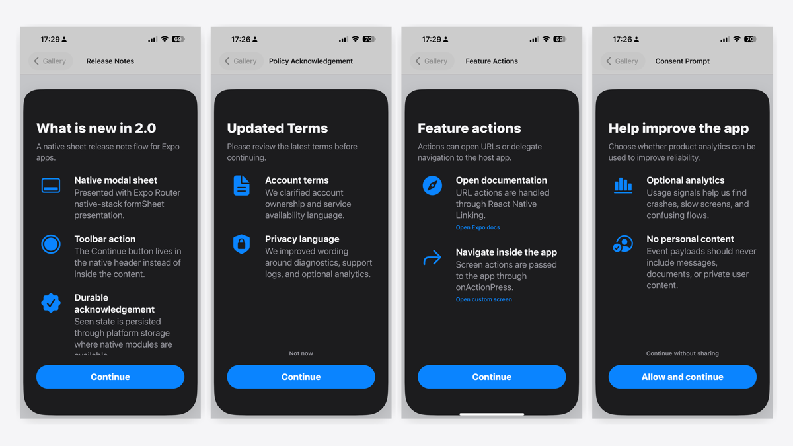

# expo-whats-new

[](https://www.npmjs.com/package/expo-whats-new)
[](https://www.npmjs.com/package/expo-whats-new)
[](https://github.com/Madraka/expo-whats-new/actions/workflows/ci.yml)
[](./LICENSE)
[](https://docs.expo.dev/)
[](https://www.typescriptlang.org/)

Typed What's New, release notes, required acknowledgement, and feature education flows for Expo and React Native apps.



The package is JS-first and Expo Module compatible. It works with a JavaScript fallback in Expo Go and exposes native app-info/storage capabilities in development builds and bare React Native apps.

## Install

```sh
npx expo install expo-whats-new
```

For non-Expo package managers or bare React Native projects, install from npm directly:

```sh
npm install expo-whats-new
```

## Quick Start

```tsx
import {
  WhatsNewModal,
  WhatsNewProvider,
  type WhatsNewRelease,
} from 'expo-whats-new';

const releases: WhatsNewRelease[] = [
  {
    version: '1.2.0',
    title: 'What is new in 1.2',
    subtitle: 'A cleaner release experience for Expo apps.',
    features: [
      {
        title: 'Smart release targeting',
        description: 'Show release notes once per version with deterministic storage.',
      },
      {
        title: 'Composable UI',
        description: 'Use the provider, hook, modal, inline view, screen, or headless logic.',
      },
    ],
  },
];

export default function App() {
  return (
    <WhatsNewProvider releases={releases} autoShow>
      <Root />
      <WhatsNewModal />
    </WhatsNewProvider>
  );
}
```

## Documentation

- App integration guide: [docs/app-integration.md](./docs/app-integration.md)
- Architecture and package boundaries: [ARCHITECTURE.md](./ARCHITECTURE.md)
- Changelog: [CHANGELOG.md](./CHANGELOG.md)

## App Responsibilities

The package core owns release validation, targeting, acknowledgement, cache, locale fallback, and composable UI contracts.

Your app owns native navigation, native sheet routes, locale discovery, icons, media playback, analytics, auth, audience selection, and Supabase/SQLite clients.

Keep app-specific libraries such as Expo Router, Lottie, Rive, Supabase, SQLite, analytics, localization, and icon packs in your app. Pass descriptors and render callbacks into `expo-whats-new` instead of adding those dependencies to the package core.
